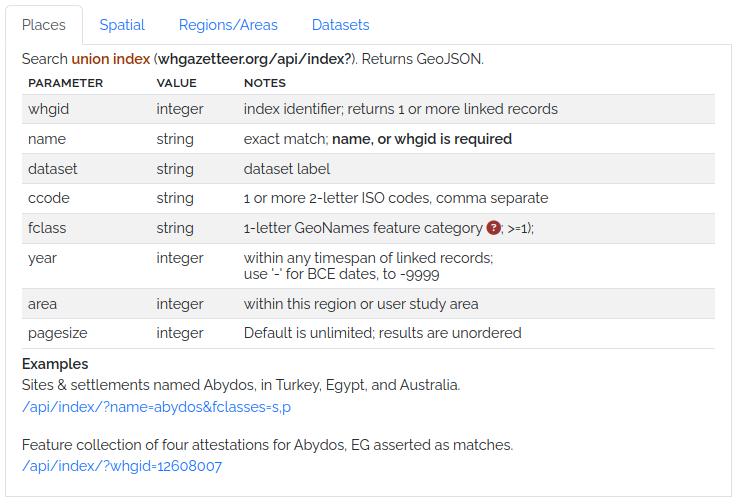
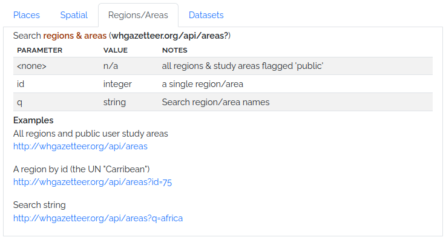
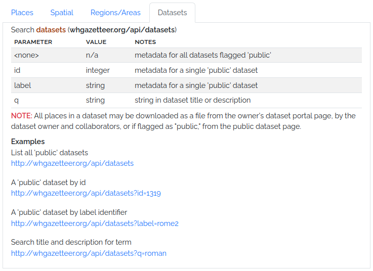

# Technical

## API

Development of a more complete and well-documented public API is in progress. We are refining options and adding
endpoints in response to community feedback. Our intention is eventually to offer a Swagger interface like the (
unrelated!) example [here](https://petstore.swagger.io/).

In the meantime, the endpoints illustrated here are available for use, but are liable to change without notice.

## Code Repositories

The WHG codebase is divided into several GitHub repositories, each with a specific focus:

* [WHG PLACE](https://github.com/WorldHistoricalGazetteer/place) (Place Linkage, Alignment, and Concordance Engine)

This repository contains the Kubernetes server configuration files for deploying and managing the World Historical
Gazetteer (WHG) application. It provides a dedicated space for configuring and orchestrating the server environment.

* [WHG v3.0b](https://github.com/WorldHistoricalGazetteer/whg3)

This repository contains the codebase for the WHG v3.0b application. It is a Django-based web application that provides
a user interface for uploading, reconciling, and publishing historical gazetteer data.

* [TileBoss](https://github.com/WorldHistoricalGazetteer/tileboss)

This repository contains the codebase for generation and serving of map tiles for the WHG application. **Its
functionality will soon be integrated into the WHG PLACE repository.**

## Issues & Discussions

We welcome feedback, bug reports, and feature requests. Please use the GitHub Issues feature in the appropriate
repository. We especially welcome contributions to the
current [Discussions](https://github.com/orgs/WorldHistoricalGazetteer/discussions).

