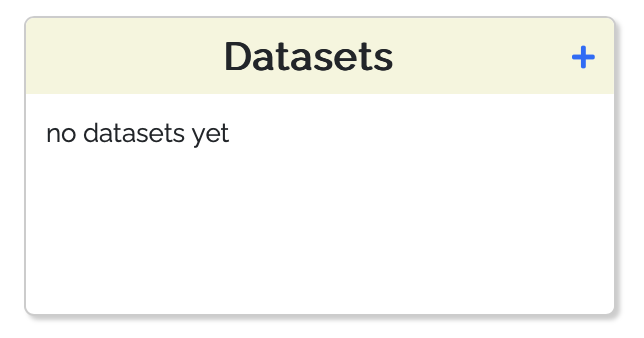
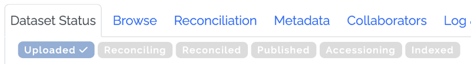
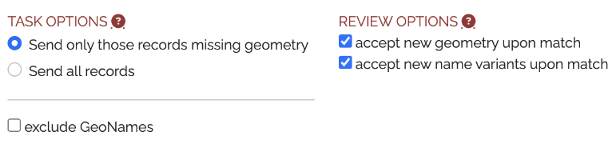
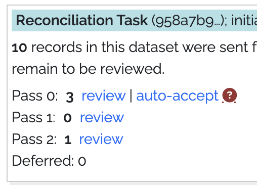
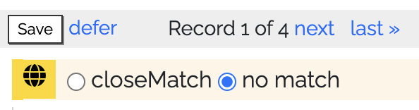

# Introduction

## Vision

Empowering discovery by connecting place names across time and language.

## Mission

The mission of the World Historical Gazetteer is to build a platform for open linked historical place data in order to
foster deeper understanding of place history and to improve discovery of places that have had many names over time. The
WHG place index is accessible through tools and services that permit users to search and browse information about
places, augment and contribute their own place records, assemble and publish information about places, and use
information about places in teaching and communication.

# Workbench Pathways

## Individual datasets

The first step for working with your own data in WHG is to prepare an upload file in one of two formats: Linked Places
format (LPF) if your data is relatively complex, or LP-TSV, a simpler delimited file format (e.g. a spreadsheet, CSV, or
TSV).
See [Choosing an upload data format: LPF or LP-TSV?](100-Tutorials.md#choosing-an-upload-data-format-lpf-or-lp-tsv) for
more information.

After making that choice, the steps are as follows:

1. Create a place data file
2. Upload it to your private workspace.

    * Click the "+" from your My Data dashboard

   

    * Fill in the required fields in the "Upload dataset" form

   

3. The Status tab will show the progress through this workflow.

    * View uploaded content in a map and table on the Browse tab
    * Initiate a reconciliation task from the Status tab, choosing desired options

    

4. Upon task completion, proceed to review prospective matches, and monitor progress on the Status tab.

5. In the Review screen record your matching decisions: "closeMatch", "no match," or "defer." A help screen () explains
   the process in detail. With each decision, the page advance to the next of your records in the queue of those that
   had any "hits."

6. When the Review step is complete, your options are to:

    * Download your now augmented data for use in other software;
    * Complete the metadata on the Metadata tab and request publication;

   

    * A further step is strongly encouraged: linking your data with records from other datasets already in the WHG union
      index. This is accomplished in a second reconciliation task, initiated on request by WHG editorial staff.

7. Accessioning to the WHG union index. This step proceeds much like steps 4 & 5 above, with these differences:

    * If no prospective match is found for a record, it is written to the index as a "seed" — 'a place for which we had
      no previous information;
    * Prospective matches presented can be either a single record or a set of 2 or more that have been previously linked
      during accessioning tasks for other datasets. A match to a set causes the incoming record to be added to that set.
      This accessioning step is how Place Portal pages are
      generated ([example](https://whgazetteer.org/places/12346428/portal/));
    * When the task is complete, the dataset is considered fully accessioned, and its records are now linked with others
      for the same places where possible. That said, it remains a distinct, published dataset within the platform,
      discoverable in the WHG publications gallery and browsable and searchable in its own publication page.

## Multiple datasets

The **Dataset Collection** feature in WHG allows an individual or collaborative group to create a historical gazetteer
resource from multiple datasets, linking those records that refer to the same place. Some examples, currently at various
stages of development, include:

* "A Historical Gazetteer of Ukraine," so far with five datasets from several time periods;
* "Indigenous Place Names in North America," so far with four datasets for distinct regions, and a fifth covering all of
  North America;
* "A Historical Gazetteer of Central Asia" — an ambitious undertaking with 10 disparate datasets drawn from
  many sources for this huge and ill-defined region. 

Published Dataset Collections can be browsed in a rich publication page including an explanatory essay, and in the near
future will be independently searchable via the WHG API — for example as a resource in annotation software. See this
step-by-step guide, [Create and publish a Dataset Collection](100-Tutorials.md#create-and-publish-a-dataset-collection).

Note that in order for a dataset to be added to a Dataset Collection, it must have been fully accessioned in the WHG
union index. See the "[WHG Union Index](100-Tutorials.md#whg-union-index)" section
in [Explaining the WHG indexes](100-Tutorials.md#explaining-the-whg-indexes) guide.

## Thematic place collections

The **Place Collection** feature in WHG is designed for two use scenarios: as a teaching or workshop exercise, or as a
form of authored publication. The steps for creating a Place Collection are the same in all cases, as detailed in the [Create
and publish a Place Collection](100-Tutorials.md#create-and-publish-a-place-collection) guide.

### Instructional exercise in a class setting, or workshop

Registered WHG users can request "group leader" permissions, which allows them to create and manage a WHG **Collection
Group**. This is a private space where students or workshop participants can create and share collections of places,
annotated with custom keywords, notes, dates, and images. The group leader can review and comment on the collections,
and can nominate exceptional collections for inclusion in the WHG Student Gallery. Students or workshop participants
join the group by entering an access key created and distributed by the instructor or workshop leader.

See "[Create and manage a class or workshop Collection Group](100-Tutorials.md#create-and-manage-a-collection-group-for-a-class-or-workshop)".

As a member of a Collection Group, an option appears on all of their collection builder pages to submit the collection
when complete—for review by the instructor or workshop leader.

### Authored publication

Any registered WHG user can create a thematic annotated [Place Collection](100-Tutorials.md#create-and-publish-a-place-collection), and request its publication on the WHG
platform, subject to review and approval by WHG editorial staff.
