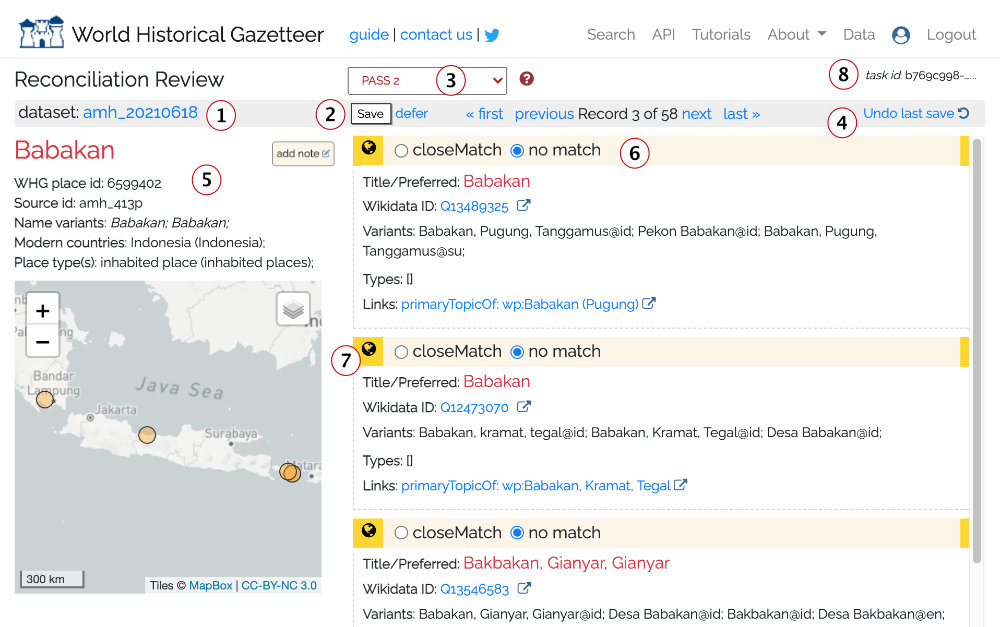
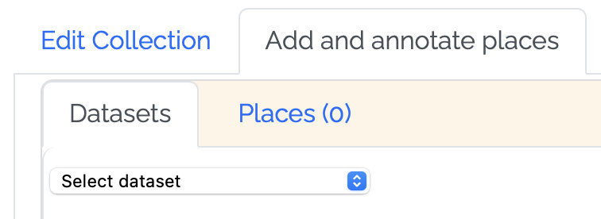
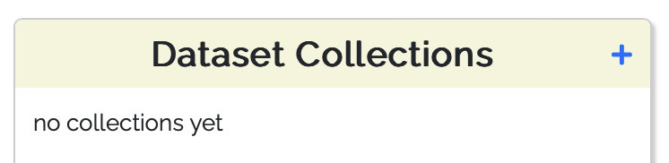
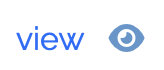
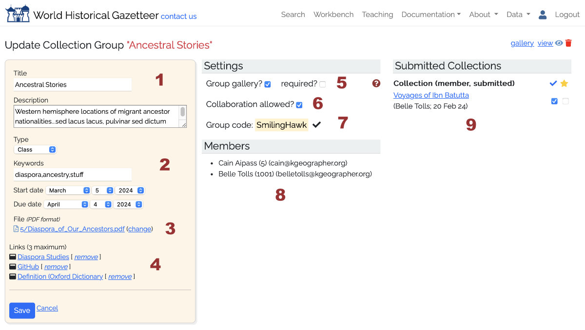

# Tutorials & Guides

## Choosing an upload data format: LPF or LP-TSV?

World Historical Gazetteer supports uploads of both Linked Places format (
LPF; [v1.2.2 specification](https://github.com/LinkedPasts/linked-places)) and its delimited
file derivative, LP‑TSV, which is more useful for relatively simple
data ([v0.5 specification](https://github.com/LinkedPasts/linked-places/blob/master/tsv_0.5.md)). In both cases, some
level of transformation has to happen between your source data and the chosen format. Both formats require that there be
one
record per place. The main distinctions can be summarized this way:

* LPF is JSON-based and supports both temporal scoping and citations for individual place names, geometries, types, and
  relations within a single place record;
* LP-TSV is a delimited file format — either a spreadsheet or a text file in CSV or TSV format. Although it can handle
  multiple name variants and place types in a single column, it can have only one geometry per place, and citation is
  possible only for the principal name ('title').

Choose LPF if:

* You have multiple names, types, geometries, or relations for a single place that are temporally scoped; i.e. any of
  these attributes are associated in your data with a given year, timespan, or period—and you want that represented in
  your WHG representation;
* You wish to include citations per name, type, geometry, or timespan.

Choose LP-TSV if:

* You have a single year or timespan that applies to the entire record (start/end or attestation year).
* Your name variants and place types can be listed in a single column, e.g. this way: "name1;name2"

## Preparing data for upload

### The simple case

If you have a list of distinct places with a name or names and basic attributes of the place, like coordinates, and
place type in a spreadsheet, database table, etc., the task of preparing an upload file for WHG is straightforward. In
almost all cases your format choice will be LP-TSV, and you can copy/paste columns from your file into WHG's [LP-TSV
spreadsheet template](https://github.com/LinkedPasts/linked-places-format/raw/main/LP-TSV_template.xlsx), as explained
in the file itself. See also, "Quick Start" on the "[Upload dataset](https://whgazetteer.org/datasets/validate/)" page.

**NOTE: Please do not use Notepad to edit TSV files, because it will not handle the tab characters correctly. Use a
dedicated spreadsheet program like Excel, Google Sheets, or LibreOffice Calc.**

### The not so simple case: extracting places

However, the data for most spatial historical projects is not only about places or locations, but principally about
events or artifacts for which location is an important dimension.

Both LPF and LP-TSV require that there be one record per place. But for many projects, a single place can have multiple
rows in a spreadsheet, or multiple features in a shapefile—each recording for example a change in some attribute at a
given time. For this reason, data often takes the form of one row per event, or artifact, or observation of some kind,
with a column for place name, and/or for latitude and longitude. In this case location information is often repeated on
each row that is about that event, or artifact, etc. **The task is to extract the distinct places, into a separate
places-only table or worksheet.**

Conflating multiple place references to a single place record often requires disambiguation or normalization, with
several kinds of decisions only the data creator can make, e.g.:

* Do two different names actually refer to the same place?
* Are an archaeological site and a modern city with the same name the same place?
* If there are multiple name variants, which should be the primary "title" of the record?
* If some references are at the scale of settlement and others at the scale of county, should they be normalized to
  county
* for purposes of analysis?

* Linked Places format (LPF), a GeoJSON extension

Apart from conflating multiple place references to a single place record, converting data from a delimited format like a
spreadsheet or shapefile attribute table to the JSON-base LPF will almost certainly require a script—using e.g. Python
or SQL if a database is involved. A how-to for this is beyond the scope of this document, but
this [CSV > JSON](https://csvjson.com/csv2json) tool
demonstrates how this will look, and a web search will locate other tools that may help.

## Explaining the WHG Indexes

WHG maintains three high-speed indexes for use in the platform, "**Wikidata+GeoNames**", the "**WHG Union Index**", and
the "**Pub**" index.

### Wikidata+GeoNames

This index of over 13 million place records from Wikidata (3.6m) and GeoNames (10m) is used for initial intitial
reconciliation of uploaded datasets, enabling their augmentation with

* Coordinate geometry their records may be missing (a "geocoding" function")
* Additional name variants
* Identifiers from additional gazetteer resources, including several national libraries, VIAF, and Getty's Thesaurus of
  Geographic Names (TGN). This has the benefit of making user records significantly more linkable —within in WHG's union
  index, and in other linked data contexts.

### WHG Union Index

The WHG Union Index is where individual records for the same or "closely matched" places coming from different datasets
are linked. Search results privilege these linked sets or "clusters" of records, and present them in Place Portal pages
like [this one](https://whgazetteer.org/places/12346428/portal/) for Glasgow.

Records from published datasets make their way into the union index by means of a second reconciliation step, following
that for the Wikidata+Geonames index. This step is initiated by WHG editorial staff, and when complete the dataset is
considered fully accessioned. See "Accessioning to the WHG Index"
in [Individual datasets](001-Introduction.md#individual-datasets) for details.

### WHG "Pub" index

When a dataset has been reconciled to the Wikidata+Geonames index and published, it is automatically added to the "Pub"
index so that its records can be discovered not only via browsing its publication page, but in search and via our
Application Programming Interface (API). If and when the dataset is reconciled to the union index, its records are
removed from "Pub," as they are now linked where possible and will appear in Place Portal pages.

## Reviewing reconciliation results

After a reconciliation task is run, the prospective matches to your records are presented for review. For each of your
records that had one or more "hits," those hit records from Wikidata and/or GeoNames are presented in a list on the
right of the screen, with your record on the left. The dataset owner and any designated collaborators decide, for each
of its records, whether one or more of the hits is a "close match." Clicking the save button records those closeMatch/no
match decisions and advances to the next record from the dataset. It is also possible to defer a decision, and placed in
a separate queue that can be revisited, possibly by someone with more relevant expertise. It is also possible to add a
note to the record for future reference.

The information displayed and options offered are explained below.

1. The user-designated label of the current dataset
2. Save / defer: After making match decisions (closeMatch or no match), click the Save button, If you want to defer a
   decision on this record, click 'defer' and it will go in a 'deferred' queue where it can be revisited. Optionally,
   add a note to help with the decision.
3. The current "PASS." If any automatic matches were made based on shared links, a PASS 0 is included, and these can be
   accepted en masse from the Linking screen. Otherwise, you will be stepped through potential matches from PASS 1 and
   then PASS 2, and in the case of Getty TGN, possibly PASS 3.
4. It is possible to undo the last Save action; sometimes we click, then think better of it.
5. The record from your dataset, as sent for matching. If it had associated geometry those will appear as green markers.
6. Close match vs. no match. This is explained in depth in its own section below
7. The globe icon indicates the potential match includes geometry. Hovering the mouse over the link will highlight it on
   the map.

### What does closeMatch mean?

The meaning of _closeMatch_ derives from the Simple Knowledge Organization
System ([SKOS](https://www.w3.org/TR/2009/REC-skos-reference-20090818/)) vocabulary, a widely used data
model. Practically speaking, for WHG asserting a `closeMatch` serves as a linking "glue." Specifically, records that
share one or more common linked asserted as `closeMatch` are joined/linked in our "union index" and returned together in
response to queries. For example, records for Abyssinia and Ethiopia share two `closeMatch` links, to a DBPedia record
and
a TGN record. Therefore, they appear together when searching for either Abyssinia or Ethiopia. We have determined there
is not a clear enough distinction with SKOS:exactMatch to offer that choice.

From the SKOS specification:

* _closeMatch_: "...(the) two concepts are sufficiently similar that they can be used interchangeably in some
  information
  retrieval applications"
* _exactMatch_: "...a high degree of confidence that two concepts can be used interchangeably across a wide range of
  information retrieval applications."

Furthermore, `closeMatch` is a super-property of `exactMatch`; that is, every `exactMatch` is also a `closeMatch`.
Remember, the purpose of the assertion is to ensure records that should intuitively appear together, do.

## Reviewing accessioning results

Review of results for accessioning to the WHG index is similar
to [review for reconciliation](#reviewing-reconciliation-results) but differs in the following
ways:

1. Instead of matching to individual records from Wikidata or GeoNames, you are deciding on matches to sets of records
   in the WHG union index — records that have been previously linked to each other. If you decide to match to a set,
   your record will be added to that set; in this case adding a third attestation for Lund.

2. If you decide there is no match and proceed, your record is indexed as a new first, or "seed", for the place.
3. When the accessioning task was run, all of your records that had no prospective matches were automatically indexed as
   new first ("seed") records for those places.

## Create and publish a Place Collection

Place Collections in the WHG are annotated sets of place records from published datasets. Places can be added to a
collection in three ways:

1. From a Place Portal page, using the "Add to Collection" button.
2. One or more from a published dataset's Browse page, using the "Add to Collection" button.

3. By adding all of the places in one of your datasets — usually a small one created for the purpose.

Once places have been added, they can be annotated in the following way:

* Create a set of "annotation keywords" for the collection — a custom vocabulary used to classify each place's relation
  to the collection theme and to style map markers

* For each place, choose a relation keyword, and a note and optional date(s) and image — then save.
* If desired, drag and drop place "cards" to order them in a sequence

At any time, add the following elements to the collection as a whole:

* A title and description
* Collection keywords (these are distinct from annotation keywords)
* An image
* Upload an explanatory essay as a PDF file
* Up to three links to external web pages or resources

Choose visualization options to control how temporal information will appear in the collection's map and table
displays (you can preview how your collection will display at any time). Options include:

* Sort by sequence, start date, or end date?
* Include animated "ant trail" lines between places?
* Display a time "slider" filter or a sequence "player" control?

If you have joined a collection group class or workshop, you have the option to submit it to the instructor or workshop
leader for review. If the group has a gallery, once reviewed, the collection will appear there. Instructors have the
option to nominate exceptional collections for the WHG Student Gallery.

If your collection is not associated with a class or workshop, you can request it be published in the site-wide [WHG
gallery](https://whgazetteer.org/datasets/gallery/) using the site contact form.

## Create and publish a Dataset Collection

A WHG Dataset Collection is a set of published, indexed datasets in WHG, whose place records have been linked with
others for the same place where they occur. Its potential purposes and possibilities are outlined in the [Multiple
datasets](001-Introduction.md#multiple-datasets) pathway section of this documentation.

All datasets in a Dataset Collection must be published and fully accessioned — that is, indexed in the WHG union index.
This is because the linking of records for the same place from multiple datasets occurs during the final indexing step.
See "Accessioning to the WHG union index" in the [Individual datasets](001-Introduction.md#individual-datasets) section.

The steps in creating a Dataset Collection are as follows:

1. Click the + in that section of your My Data dashboard, then fill in the three required fields on the Create Dataset
   Collection form.

2. On the "Add and manage datasets" tab of Dataset Collection Builder screen that follows, you can begin adding
   datasets. The dropdown menu lists accessioned datasets that you own are are a designated collaborator on.
3. You can add collaborators on the Collaborators tab. Co-owners are able to add datasets, and datasets they own will
   appear in the dropdown list of eligible datasets.
4. You can preview the still private presentation of the collection at any time by clicking the "view" icon in the upper
   right.

5. Each Dataset Collection should have an accompanying essay and image prior to publication. You can also add up to
   three links to related external web resources.
6. If a significant proportion of the collection's records have meaningful date information, turn on the "Display
   temporal information" switch. This will ensure the collection table has start and end columns, and that there is a
   time "slider" filter overlay on the map.
7. When you are ready to publish, click the "Request publication" button. This will notify WHG editorial staff that the
   collection is ready for review and publication. The timing of publication is up to its creators. Typically, datasets
   will be added over time, and it is sensible to publish the collection early, especially if it is a goal to attract
   addition datasets and collaborators.

## Create and manage a Collection Group for a class or workshop

The **Collection Group** feature in WHG is designed primarily for instructional scenarios, but can also be used for
workshops. Any registered user can request "group leader" permissions, which allow them to create and manage a WHG
Collection Group. This is a private space where students or workshop participants can create and share collections of
places (WHG Place Collections), annotated with custom keywords, notes, dates, and images. The group leader can review
submitted collections, and can nominate exceptional collections for inclusion in the WHG Student Gallery. Students or
workshop participants join the group by entering an access key created and distributed by the instructor or workshop
leader.

The workflow in both cases is very similar:

* Request group leader privileges using the site-wide contact form.
* On your "My Data" dashboard, a plus sign (+) appears in the "Collection Groups" box.

* Add a new Collection Group by filling the required fields in the form. Upon save, you are brought to the "Update
  Collection Group" screen where you will configure the group and manage submissions.

1. Edit title and description.
2. Choose type (class or workshop), add keywords, start date and if applicable, due date.
3. Upload a file (PDF format) with the course or workshop description, requirements, etc.
4. Add up to 3 links to external web resources.
5. Will this class/workshop have a gallery of completed works, visible to its members after completion? If so, are all
   submissions required to appear in it?
6. Are collaborators permitted?
7. Generate a group signup code and distribute it to students/participants, who join by entering the code on their own
   dashboard.
8. As members join, they appear on this list
9. For each submission, flag as 'reviewed' and if appropriate, nominated for the WHG Student Gallery.

* When a student/participant enters the group code in their _My Data_ dashboard, they get access to the PDF guide you
  have created, with guidelines for this particular exercise—the theme, or goals. **NOTE: Technical instructions for
  creating a [Place Collection](001-Introduction.md#thematic-place-collections) are covered in site documentation and
  need not be included in this group guide.**
* As collections are submitted to the group, they are listed (9) and you can review them and nominate them for inclusion
  in the WHG Student Gallery (in development).
* Communication between instructor/leader and students/participants is left to normal email and/or course management
  software if applicable.