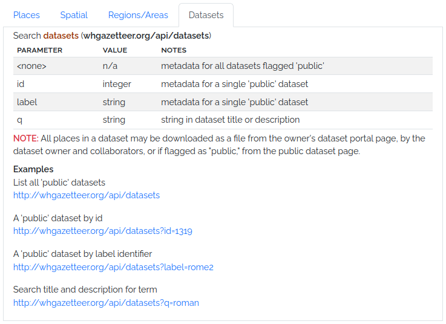

# Technical

## API

Development of a more complete and well-documented Reconciliation API is in progress (see below). We are refining options and adding
endpoints in response to community feedback. Our intention is eventually to offer a Swagger interface like the (unrelated!) example [here](https://petstore.swagger.io/).

In the meantime, the endpoints illustrated here are available for use, but are liable to change without notice.





## Reconciliation API

The WHG Reconciliation API provides standardised endpoints for reconciling
place names and exploring additional properties of candidate places. It implements
portions of the **[Reconciliation Service API v0.2](https://w3c.github.io/cg-reports/reconciliation/CG-FINAL-specs-0.2-20230410/)**, a widely-used protocol for
data matching on the Web. It is compatible with **OpenRefine**.

> ⚠️ **Work in progress:** This API will require API tokens for authentication. Registered Users will be able to generate a token through their Profile page.
> 
>Endpoints, fields, and behaviours are only very partially implemented, and are subject to change.

### Endpoints

#### `/reconcile/`
- Accepts **POST** requests with one or more place name queries.
- Returns candidate matches for each query, including:
  - Canonical name
  - Alternative names
  - Match score (normalized 0–100)
  - Exact match flag
  - Full geometries in GeoJSON format
- Batch requests are supported, with a configurable limit (`batch_size`).
- Authentication via API token (`Authorization: Bearer <token>`) or session/CSRF.
- **Parameter usage:** *[Placeholder: describe how to set search parameters like fuzzy match, phonetic similarity, spatial filters, temporal ranges, etc.]*

#### `/reconcile/extend/propose`
- Accepts **POST** requests with candidate places.
- Returns a list of suggested additional properties that clients may request
  for each candidate, such as:
  - Temporal range (years)
  - Source dataset
  - Country codes
  - Alternative names

#### `/reconcile/extend`
- Accepts **POST** requests with candidate places.
- Intended to compute and return values for additional properties.
- Currently **not implemented** (returns HTTP 501).

#### `/suggest`
- Accepts **POST** requests to suggest entities, properties, or types.
- Currently **not implemented** (returns HTTP 501).

### Programmatic Examples

```bash
curl -X POST https://whgazetteer.org/reconcile/ \
     -H "Content-Type: application/json" \
     -H "Authorization: Bearer <API_TOKEN>" \
     -H "User-Agent: notbot" \
     -d '{"queries":{"q1":{"query":"Glasgow"}}}'
```

```python
import requests

url = "https://whgazetteer.org/reconcile/"
headers = {"Authorization": "Bearer <API_TOKEN>", "Content-Type": "application/json"}
payload = {"queries": {"q1": {"query": "Glasgow"}}}
response = requests.post(url, json=payload, headers=headers)
print(response.json())
```

### Notes
- Geometries are always returned to allow visual disambiguation of candidates.
- This API is compatible with **OpenRefine** using the Reconciliation Service API protocol.
- Suggest endpoints for entity, property, and type will be implemented separately.


## Code Repositories

The WHG codebase is divided into several GitHub repositories, each with a specific focus:

* [WHG PLACE](https://github.com/WorldHistoricalGazetteer/place) (Place Linkage, Alignment, and Concordance Engine)

This repository contains the Kubernetes server configuration files for deploying and managing the World Historical
Gazetteer (WHG) application. It provides a dedicated space for configuring and orchestrating the server environment.

* [WHG v3.0b](https://github.com/WorldHistoricalGazetteer/whg3)

This repository contains the codebase for the WHG v3.0b application. It is a Django-based web application that provides
a user interface for uploading, reconciling, and publishing historical gazetteer data.

* [TileBoss](https://github.com/WorldHistoricalGazetteer/tileboss)

This repository contains the codebase for generation and serving of map tiles for the WHG application. **Its
functionality will soon be integrated into the WHG PLACE repository.**

## Issues & Discussions

We welcome feedback, bug reports, and feature requests. Please use the GitHub Issues feature in the appropriate
repository. We especially welcome contributions to the
current [Discussions](https://github.com/orgs/WorldHistoricalGazetteer/discussions).


