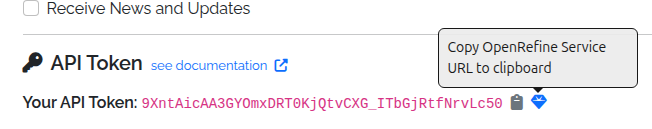

# Technical

## APIs (Application Programming Interfaces)

> ⚠️ **Work in progress:** The APIs are currently undergoing testing prior to public release.

The World Historical Gazetteer (WHG) provides two complementary APIs:

### Entity API
- Access canonical representations of our entities: **Places**, **Datasets**, **Collections**, **Areas**, and **[PeriodO](https://perio.do/) Periods**.
- Retrieve full metadata, names, types, geometries, temporal bounds, authority info, and linked resources.
- Machine-readable feature endpoints support Linked Places Format (LPF) for GIS and reconciliation tools.
 
### Reconciliation Service API
- Compatible with [OpenRefine](https://openrefine.org/).
- Supports both Place and [PeriodO](https://perio.do/) suggestions, batch reconciliation, and property enrichment.
- **Data Extension** is supported, allowing users to enrich their tables with properties like **Geometry**, **Alternative Names**, **Temporal Range**, and **Country Codes** after reconciliation.

### Documentation

Full, interactive documentation is available at https://whgazetteer.org/api/schema/swagger-ui/

### API Tokens

**Tokens are required for access to most WHG API endpoints.**

> ⚠️ **Work in progress:** Tokens are not yet available. For now, the following describes only the intended
> functionality.

Registered users can generate an API token from their Profile page.
Alongside the token, the Profile page also provides a preconfigured [OpenRefine](https://openrefine.org/) reconciliation
service URL, which can be copied and pasted into OpenRefine's reconciliation dialog,
under "Add Standard Service".



#### Using an API Token

The simplest way to use an API token is to include it as a query parameter in the request URL. For example:

```bash
https://whgazetteer.org/reconcile/?token=<token>
```

Otherwise, it may be included in the `Authorization` header, using the `Bearer` schema. Requests **must** also include a suitable
`User-Agent` to avoid bot-filters. For example:

```bash
curl -X POST https://whgazetteer.org/reconcile/ \
  -H "Content-Type: application/json" \
  -H "Authorization: Bearer <token>" \
  -H "User-Agent: notbot" \
  -d '{
    "queries": {
      "q1": {
        "query": "London",
        "mode": "fuzzy",
        "fclasses": ["A","P"],
        "start": 1200,
        "end": 2050,
        "undated": true,
        "countries": ["GB","US"],
        "bounds": {
          "geometries": [{
            "type": "Polygon",
            "coordinates": [[
              [-1.0,51.0],
              [-1.0,52.0],
              [0.5,52.0],
              [0.5,51.0],
              [-1.0,51.0]
            ]]
          }]
        }
      }
    }
  }'
```

## Code Repositories

The WHG codebase is divided into several GitHub repositories, each with a specific focus:

* [WHG PLACE](https://github.com/WorldHistoricalGazetteer/place) (Place Linkage, Alignment, and Concordance Engine)

This repository contains the Kubernetes server configuration files for deploying and managing the World Historical
Gazetteer (WHG) application. It provides a dedicated space for configuring and orchestrating the server environment.

* [WHG v3.0b](https://github.com/WorldHistoricalGazetteer/whg3)

This repository contains the codebase for the WHG v3.0b application. It is a Django-based web application that provides
a user interface for uploading, reconciling, and publishing historical gazetteer data.

* [TileBoss](https://github.com/WorldHistoricalGazetteer/tileboss)

This repository contains the codebase for generation and serving of map tiles for the WHG application. **Its
functionality will soon be integrated into the WHG PLACE repository.**

## Issues & Discussions

We welcome feedback, bug reports, and feature requests. Please use the GitHub Issues feature in the appropriate
repository. We especially welcome contributions to the
current [Discussions](https://github.com/orgs/WorldHistoricalGazetteer/discussions).


